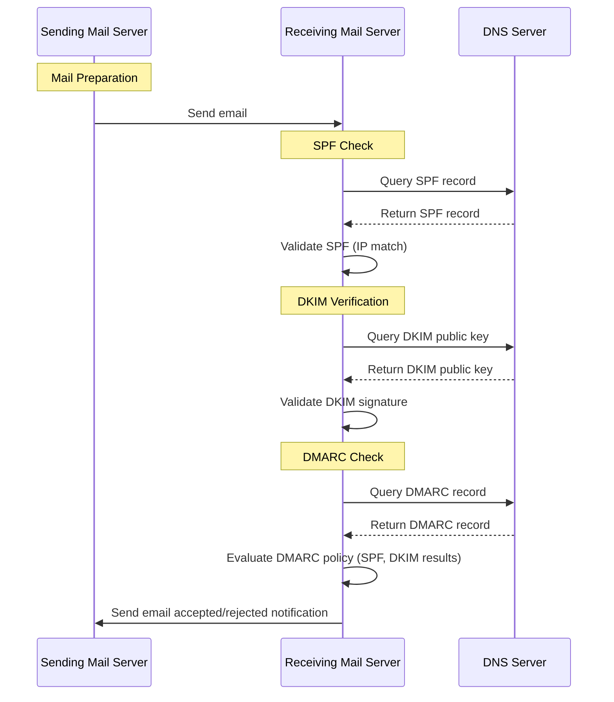

# DNS

Knowledge base for all things DNS.

## Mail Records

DMARC, DKIM, and SPF... GAAHHHH!!!

Yeah, I remember not knowing what the heck these things meant. Its really weird how things that were once mysterious are now simple. I hope is to explain these abbreviations in the simplest way I know how.

All three of these protocols exist because of how easy it is to spoof the FROM email address on an email. They protect domains from being spoofed by malicious actors.

Quite literally, you can send an email and change the FROM to anything! On closer inspection of the entire email message, you might notice there are actually two FROM properties, one is an email address and another is an IP address or domain.

The second FROM is the IP address domain name of the sending mail server.

This is important because there is a way to configure your email domain (ie `<username>@<domain>`) to only authorize certain IPs or domains to send mail addressed as `<username>@<domain>`.

And that is via the SPF record. With SPF, you add all the IPs and domain names that are allowed to send mail for that domain. So if you own `example.com`, and you configure SPF on the dns settings for `example.com`, you are telling receiving mail servers that when they check `example.com` for SPF TXT record, that the IPs listed in there are the only sending mail servers authorized to send mail for `example.com`.

Below is a chart that might help visualize how the servers use the protocols that an email is authentic.

