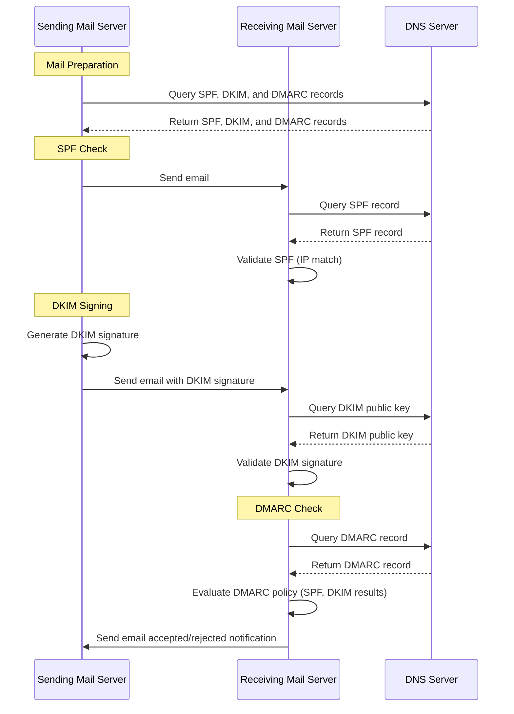

# DNS

Knowledgebase for all things DNS.

## Mail Records

DMARC, DKIM, and SPF... GAAHHHH!!!

Yeah, I remember not knowing what the heck these things meant. Its really weird how things that were once mysterious are now simple. I hope is to explain these abbreviations in the simplest way I know how.

